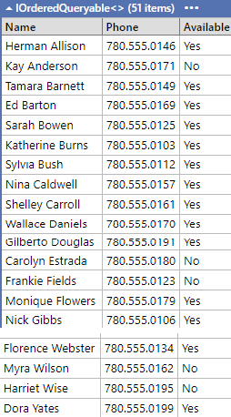
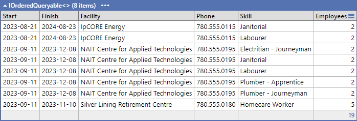
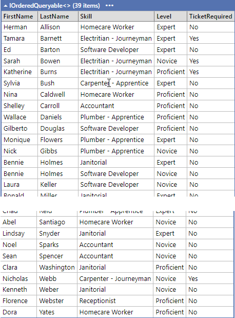
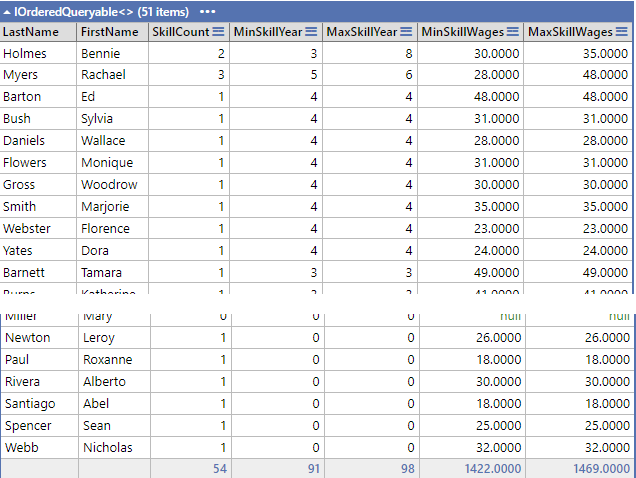
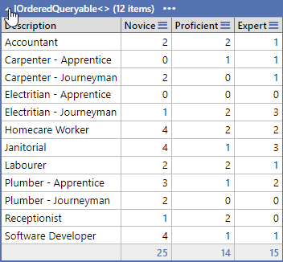

# LINQ and LinqPad Exercise - Part 1 (5 Marks)

## Private GitHub Repo Only

This exercise is based on the Work Schedule database. For this exercise, provide your answers as LinqPad (.linq) document(s) in a single LinqPad document containing all questions (you will need to use Statements as the LinqPad environment). You **must** do a commit after completing each question.

1. List all employees.  Order by "Last Name".

    

1. Your company is looking to identify skills required for upcoming contracts that involve a large number of employees. You need to find skills required for contracts with more than 1 employees.  Order by "Facility" then "Skills".

    

1. You are tasked with creating a report of skills required for contracts, sorted alphabetically by "Last Name", "Level (expert -> novice) and "Skill.  **Only show those employees who are active.**  Use the following text for the levels: 1 = Novice, 2 = Proficient, 3 = Expert.

    

1. You need to gather some information for your manager.  Order by "Maximum Skill Years" then "Last Name"

    

1. List Skills and the number of novice, proficient and experts.  Order by "Skills"

    
