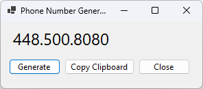

# Transaction Integrated Implementation Exercise (5 marks)

Given the following user-interface form, using your transaction service method, create a work web page that will register new skill(s) for an existing employee and/or register a new employee and their skill(s). Create a second page that will take in an employee phone number and return the employee first name, last name and a collection of employee skills. **The second page will display the data.**

---

**Objective:** Develop two web pages that interact with a user-interface form and transaction service method.

**Page 1: Employee Skill Registration**
1. Design a web page to either:
   - Register new skills for an already existing employee.
   - Register a completely new employee along with their skill(s).

2. Ensure the form processes the entirety of the data in one transaction within the Business Logic Layer (BLL).

**Page 2: Employee Skill Lookup**
1. Develop a web page that accepts an employee's phone number as input.
2. The page should then display the following:
   - Employee's first name
   - Employee's last name
   - A list or collection of the employee's skills.

**Guidelines:**
- Follow the instructional examples provided to integrate your service method with the web form.
- The user-interface form is tailored to gather employee skill registration data. Bear in mind that an individual could either be a brand-new employee or an existing employee updating or adding new skills.

To further aid your development, here are two examples of the registration form:

---


## Example 1


## Example 2


---

## **Register Page**

### **Form Processing Requirements:**

- **Clear Button:** 
   * Clears all data currently inputted into the form.

- **Register Button:** 
   * Submits Employee and Skill data to the service method within your class library.
   * Validate that the last name, first name, and phone number fields are filled out before executing the service method.
   * Ensure user-friendly error handling.
   * Organize the skill table to aggregate all the relevant data into a single collection.
   * Display a success notification when the transaction completes without issues.

### **Integration with Class Library:**

1. **Extension Method Setup:** 
   * Create an extension method within the class library, which will be invoked by `Program.cs`.
   
2. **Connection String Configuration:** 
   * Utilize your user-secret to manage the database connection string.

3. **Service Method Registration:** 
   * Register your service method within the previously created extension method.

4. **Implementation Details:** 
   * Incorporate the service method from your previous lab into your class library.
   * Design your data models as public classes for external accessibility.
   * Both the context and entity classes should have an internal scope.

---

## Display Page

Note the following requirements when processing the **display** form:

Clear

- Clears the current form of data

Fetch

- Phone data will be passed to your service method in your class library. 
- Must handle errors in a user friendly manner.
- The search method will validate that the phone number were supplied before calling service method.

Note the following requirements when integrating your class library:

- create a serivce method which will return the request query data

## Changes to the process.
* When saving a new employee registration, use the **Home Phone Number** to check if the employee already exists in the database. Similarly, when retrieving employee details, use the **Home Phone Number** for the lookup.
## **Refactoring Instructions**

### **Method: AddEditEmployeeRegistration**

1. **Employee Retrieval:** 
   * Modify the method to utilize the phone number as the key to fetch existing employees and their associated skills.
   
2. **Skill Handling:** 
   * If the employee is already in the system:
     * Use the existing employee's ID to append new skills.
     * Utilize the existing skill ID to make updates to any pre-existing skills.

### **Method: GetEmployeeRegistration**

- **Data Retrieval Update:** 
   * Adjust the method to rely on the phone number for fetching data, instead of using the Employee ID.

---


## Changes to the View Models.
##### EmployeeRegistrationView
* Remove EmployeeID
```csharp
public class EmployeeRegistrationView
{
    public string FirstName { get; set; }
    public string LastName { get; set; }
    public string HomePhone { get; set; }
    public bool Active { get; set; }
    public List<EmployeeSkillView> EmployeeSkills { get; set; } = new();
}
```

##### EmployeeSkillView
* Remove EmployeeSkillID
* Remove EmployeeID
* Add bool SelectedSkill
* Add string Skill
* Add string LevelName
```csharp
public class EmployeeSkillView
{
    public bool SelectedSkill { get; set; }
    public int SkillID { get; set; }
    public string Skill { get; set; }
    public int Level { get; set; }
    public string LevelName { get; set; }
    public int? YearsOfExperience { get; set; }
    public decimal HourlyWage { get; set; }
}
```

##### SkillLevelView
```csharp
public class SkillLevelView
{
    public int LevelID { get; set; }
    public string Level { get; set; }
}
```

## Other
* Pages will be created in a folder call "WS".
* Phone number mask is **XXX.XXX.XXXX**
* **Random Phone Generator** has been provided for you.
</br>




## Marking Summary

| Evaluation Item  | Weight | **Mark** | Comments |
|-------------------------------|:------:|:--------:|:--------:|
| Create query for Employee Display:   | 1  |  |   |
| Create query web page: controls, and format      | 2      |  |   |
| Create query web page: Displays the employee fullname and employeeskill records      | 2      |  |   |
| Implement your methods from Exercise 3 in class library      | 1      |  |   |
| Create registration web page:  controls, binding property linkages  | 4      |  |   |
| Clear method:  clears web page     | 1      |   |   |
| Register method: passes register list to service method  | 1      |  |   |
| Appropriate error handling applied across the web page  | 3      |  |   |
| **Penalty** - transaction service method: processing **NOT** done within a single transaction | -3 Max    |  |  |
| Total                                                                                                      | *15*   |  |   |

### Marking Rubric

| Weight | Breakdown |
| ----- | --------- |
| **1** | 1 = **Proficient** (requirement is met)<br />0 = **Incomplete** (requirement not met, missing large portions) |
| **2** | 2 = **Proficient** (requirement is met)<br />1 = **Limited** (requirement is poorly met, minor errors)<br />0 = **Incomplete** (requirement not met, missing large portions) |
| **3** | 3 = **Proficient** (requirement is met)<br />2 = **Capable** (requirement is adequately met, minor errors)<br />1 = **Limited** (requirement is poorly met, major errors)<br />0 = **Incomplete** (requirement not met, missing large portions) |
| **4** | 4 = **Proficient** (requirement is met)<br />3 = **Capable** (requirement is adequately met, minor errors)<br />2 = **Acceptable** (most requirements are adequately met, minor errors)<br />1 = **Limited** (requirement is poorly met, major errors)<br />0 = **Incomplete** (requirement not met, missing large portions) |

----

## ERD


